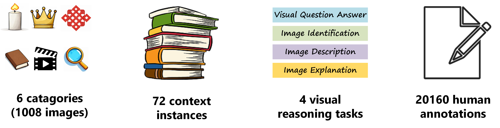

<h1 align='center' style="text-align:center; font-weight:bold; font-size:2.0em;letter-spacing:2.0px;">
  Challenging and Enhancing the Reasoning Capacity of Multimodal LLMs in Context-violating Images
</h1>      
<p align='center' style="text-align:center;font-size:1.25em;">
    <a href="https://github.com/Tough-Stone" target="_blank" style="text-decoration: none;">Hongxi&nbsp;Li</a>,&nbsp;
    <a href="https://wuxinxiao.github.io/" target="_blank" style="text-decoration: none;">Yuyang&nbsp;Chen</a>,&nbsp;
    <a href="https://wuxinxiao.github.io/" target="_blank" style="text-decoration: none;">Yayun&nbsp;Qi</a>,&nbsp;
    <a href="https://wuxinxiao.github.io/" target="_blank" style="text-decoration: none;">Xinxiao&nbsp;Wu</a>,&nbsp;<br/>
&nbsp;Beijing Institute of Technology<br/>
<em>arXiv 2024</em><br/>
<a href="https://tough-stone.github.io/contextualbench" title="Website" target="_blank" rel="nofollow" style="text-decoration: none;">🌎Website</a> |
<a href="https://huggingface.co/datasets/ToughStone/ContextualBench" title="Dataset" target="_blank" rel="nofollow" style="text-decoration: none;">📚Dataset</a> |
<a href="https://wuxinxiao.github.io/" title="arXiv" target="_blank" rel="nofollow" style="text-decoration: none;">📄arXiv  (Comming soon)</a> |
<a href="https://huggingface.co/spaces/ToughStone/ContextualBench_Leaderboard" title="Leaderboard" target="_blank" rel="nofollow" style="text-decoration: none;">🏆 Leaderboard</a>
</p>

<p align='center'>

</p>

# 1. Project Structure
<!-- ```
├── models：模型文件
├── datasets：数据集文件
│   ├── images：图像
│   └── annotation.xlsx：标注
├── database：知识库文件
├── results：推理结果文件
│   ├── image_caption：图像描述结果
│   ├── question_answer：视觉问答结果
│   ├── image_identification：图像识别结果
│   └── image_explanation：图像解释结果
├── baseline：基线程序
│   ├── LLaVA：LLaVA官方代码
│   ├── mPLUG-Owl：mPLUG-Owl官方代码
│   ├── mPLUG-Owl2：mPLUG-Owl2官方代码
│   ├── Otter：Otter官方代码
│   ├── openflamingo：openflamingo官方代码
│   ├── MIC：MMICL官方代码
│   ├── llama：llama官方代码
│   ├── FastChat：vicuna官方代码
│   ├── demo：演示推理代码
│   ├── infer_image_caption.py：图像描述推理程序
│   ├── infer_question_answer.py：视觉问答推理程序
│   ├── infer_image_identification.py：图像识别推理程序
│   ├── infer_image_explanation.py：图像解释推理程序
│   └── pipeline.py：流水线方法推理程序
├── ours：方法程序
│   ├── database_construct.py：知识库构建程序
│   ├── retrieval_augment_generation.py：检索增强生成程序
│   └── object_detection.py：目标检测程序
├── tools：工具程序
│   ├── generate_vqa.py：vqa数据生成程序
│   ├── preprocess.py：数据预处理程序
│   └── download.py：模型下载程序
└── evaluate：评估程序
│   ├── eval_image_caption.py：图像描述评估程序
│   ├── eval_question_answer.py：视觉问答评程序
│   └── eval_image_explanation.py：图像解释评估程序
└── result：预测结果
│   ├── image_caption：图像描述结果，对应论文表1
│   ├── question_answer：视觉问答结果，对应论文表1
│   ├── pipeline_identification：图像识别结果（流水线），对应论文表2
│   ├── pipeline_explanation：图像解释结果（流水线），对应论文表2
│   ├── image_identification：图像识别结果（端到端），对应论文表3
│   └── image_explanation：图像解释结果（端到端），对应论文表3
└── readme.md：说明文件
``` -->


```
├── models：checkpoint files
├── datasets
│   ├── images
│   └── annotation.xlsx
├── database：
├── results
│   ├── image_caption：
│   ├── question_answer：
│   ├── image_identification：
│   └── image_explanation：
├── baseline：
│   ├── LLaVA：LLaVA official project
│   ├── mPLUG-Owl：mPLUG-Owl official project
│   ├── mPLUG-Owl2：mPLUG-Owl2 official project
│   ├── Otter：Otter official project
│   ├── openflamingo：openflamingo official project
│   ├── MIC：MMICL official project
│   ├── llama：llama official project
│   ├── FastChat：vicuna official project
│   ├── demo
│   ├── infer_image_caption.py
│   ├── infer_question_answer.py
│   ├── infer_image_identification.py
│   ├── infer_image_explanation.py
│   └── pipeline.py
├── ours
│   ├── GLIP: GLIP official project 
│   ├── database_construct.py
│   ├── retrieval_augment_generation.py
│   └── object_detection.py
├── tools
│   ├── generate_vqa.py
│   ├── preprocess.py
│   └── download.py
└── evaluate
│   ├── eval_image_caption.py
│   ├── eval_question_answer.py
│   ├── eval_question_answer.py
│   ├── eval_pipeline.py
│   └── eval_image_explanation.py
└── result
│   ├── image_caption:table-1
│   ├── question_answer:table-1
│   ├── pipeline_identification:table-2
│   ├── pipeline_explanation:table-2
│   ├── image_identification:table-3
│   └── image_explanation:table-3
└── readme.md
```

# 2. Run

## (1) checkpoint download
```shell
export HF_ENDPOINT=https://hf-mirror.com
cd main
python download.py
```

## (2) data preprocess
```shell
python preprocess.py -task caption
python preprocess.py -task explanation
python preprocess.py -task vqa
```

## (3) environmental installation
BLIP series, mplug_owl series, llava series, etc. (refer to the environmental configuration of the official GitHub project)

```shell
conda activate blip
conda activate mplug_owl
conda activate mplug_owl2
conda activate llava
conda activate llama
conda activate vicuna
conda activate cfr
```

## (4) baseline inference

[Note:] The experimental test inputs for the four tasks vary slightly.

- <u>Image Captioning</u> and <u>Visual Question Answering</u> are tested on all images, including positive and negative samples. Only zero-shot setting is applied.
- <u>Image Recognition</u> is tested on all images. In the few-shot setting, in addition to reading the test image, it is also necessary to read 2 random samples (which may be positive or negative) from the same knowledge background as the test image; in the CoCoT setting, in addition to reading the test sample, it is also necessary to read the corresponding 1 opposite sample.
- <u>Image Explanation</u> is tested on negative sample images. In the few-shot setting, in addition to reading the test image, it is also necessary to read 2 random samples (which may be positive or negative) from the same knowledge background as the test image; in the CoCoT setting, in addition to reading the test sample, it is also necessary to read the corresponding 1 opposite sample (positive sample).
- GPT-4V is an exception. Post-processing of the results from <u>Image Explanation</u> is performed to obtain the results for <u>Image Recognition</u>, therefore its <u>Image Recognition</u> is also tested on negative samples.
- In the pipeline method, under the few-shot setting, the samples selected are two samples drawn from the entire dataset (which may be positive, negative, or from other knowledge backgrounds).


1. image caption inference
```shell
python infer_image_caption.py -model BLIP-Base
```
2. VQA inference
```shell
python infer_question_answer.py -model BLIP-Base
```
3. image identification inference
```shell
python infer_image_identification.py -model BLIP2-XL -setting z
```
4. image explanation inference
```shell
python infer_image_explanation.py -model BLIP2-XL -setting z
```
5. pipeline method inference
```shell
python pipeline.py -model LLaMA-2-7B -setting z -withCoT n
```

baseline models for image caption：
| model | checkpoint file |
|:------ |:-------|
| BLIP-Base | ./models/blip-image-captioning-base |
| BLIP2-XL | ./models/blip2-flan-t5-xl |
| BLIP2-XXL | ./models/blip2-flan-t5-xxl |
| InstructBLIP-XL | ./models/instructblip-flan-t5-xl |
| InstructBLIP-XXL | ./models/instructblip-flan-t5-xl |
| mPLUG-owl-7B | ./models/mplug-owl-llama-7b |
| mPLUG-owl2-7B | ./models/mplug-owl2-llama-7b |
| LLaVA-1.5-7B | ./models/llava-v1.5-7b |
| LLaVA-1.6-7B | ./models/llava-v1.6-vicuna-7b |

baseline models for VQA：
| model | checkpoint file |
|:------ |:-------|
| BLIP-Base | ./models/blip-vqa-base |
| BLIP2-XL | ./models/blip2-flan-t5-xl |
| BLIP2-XXL | ./models/blip2-flan-t5-xxl |
| InstructBLIP-XL | ./models/instructblip-flan-t5-xl |
| InstructBLIP-XXL | ./models/instructblip-flan-t5-xl |
| mPLUG-owl-7B | ./models/mplug-owl-llama-7b |
| mPLUG-owl2-7B | ./models/mplug-owl-llama2-7b |
| LLaVA-1.5-7B | ./models/llava-v1.5-7b |
| LLaVA-1.6-7B | ./models/llava-v1.6-vicuna-7b |

baseline models for image indentification and explanation
| model | checkpoint file | setting |
|:------ |:-------|:-------|
| BLIP2-XL | ./models/blip2-flan-t5-xl | zero-shot |
| BLIP2-XXL | ./models/blip2-flan-t5-xxl | zero-shot |
| InstructBLIP-XL | ./models/instructblip-flan-t5-xl | zero-shot |
| InstructBLIP-XXL | ./models/instructblip-flan-t5-xl | zero-shot |
| mPLUG-owl-7B | ./models/mplug-owl-llama-7b | zero-shot |
| mPLUG-owl2-7B | ./models/mplug-owl2-llama-7b | zero-shot |
| LLaVA-1.5-7B | ./models/llava-v1.5-7b | zero-shot |
| LLaVA-1.6-7B | ./models/llava-v1.6-vicuna-7b | zero-shot |
| MMICL | ./models/MMICL-Instructblip-T5-xl  | few-shot, CoCoT |
| OpenFlamingo | ./models/OpenFlamingo-3B-vitl-mpt1b | few-shot, CoCoT |
| Otter-7B | ./models/OTTER-Image-LLaMA7B-LA-InContext | few-shot, CoCoT |
| GEMINI | coming soon... | few-shot, CoCoT |
| GPT-4V | sk-XXXXXXXXXXXXXXXXXXXXX | few-shot, CoCoT |


LLM models for pipeline method
| model | checkpoint file |
|:------ |:-------|
| llama-2-7b | ./models/Llama-2-7b-hf |
| llama-2-13b | ./models/Llama-2-13b-hf |
| vicuna-1.5-7b  | ./models/vicuna-7b-v1.5 |
| vicuna-1.5-7b | ./models/vicuna-13b-v1.5 |
| GPT-3.5 | sk-XXXXXXXXXXXXXXXXXXXXX |

## (5) ours method inference
coming soon...

# 3. performance evaluation
1. image caption evaluation
```shell
python evaluate/eval_image_caption.py
```
2. VQA evaluation
```shell
python evaluate/eval_question_answer.py
```
3. image identification evaluation
```shell
python evaluate/eval_identification.py
```
4. image explanation evaluation
```shell
python evaluate/eval_image_explanation.py
```
